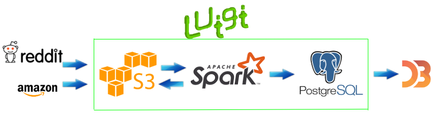

# Games'ON 

For gamers, by gamers. [Link](https://docs.google.com/presentation/d/1UiaVdh7vm3-zZy_zAdr0yUroDv7sSAVyL2oXPm6rg1g/edit#slide=id.p)

## Introduction
Developing new games are becoming more and more expensive.

Developers can learn by gamers:  MOD for games, discussion platforms like
Reddit and Steam where developers can learn from gamers about their opinions and ideas.

For gamers mean that developers can also satisfy gamers want, make remaster version of games which can satisfy both sales volume and gamers anticipation.

## Data
Reddit comments data from [Pushshift.io](https://files.pushshift.io/reddit/).
In this project, I use the data from 2017 to 2015, around 700GB of uncompressed JSON data in total. Defined schema after preprocessing is listed as:

Key | Value Type
----| ----------
created_utc | int (utc)
id | str
score | int
author | str
body | str
subreddit | str
name | str

Amazon Customer review data from [Amazon S3](https://s3.amazonaws.com/amazon-reviews-pds/readme.html). The Amazon customer review data varies from 1995 to 2015, has around 170GB of data. In this project, I only query under the video games subcategory.

Steam selling ranking data from [steam250](https://steam250.com/). This platform offers year by year best selling games with ratings.

## Architecture

- Raw data of Reddit stored on S3 in Year-Month format, load Amazon customer reviews from S3 bucket.
- Preprocessed Reddit Data, use predefined schema to drop irrelevant results.
- Spark jobs are run using Luigi for the workflow manager, with results stored in PostgreSQL. 
- Interactive chart visualization using D3.js  

## Processing Workflow

The Reddit data is read from S3 as a spark dataframe, drop irrelevant columns and a simple tokenization is applied to the 'body' column. This intermediate representation
of the data is written back to S3 for further data analysis. 

Use Luigi to schedule process the spark jobs month by month, save this result to postgres using jdbc. Steam tables are created in postgres using data from steam250. Filter the tables based on month find by Reddit results, retrieve the top selling games which published in that month. Query the results from Amazon customer reviews database and make a LDA topic modelling results. Visualize the bar charts using D3.js 
